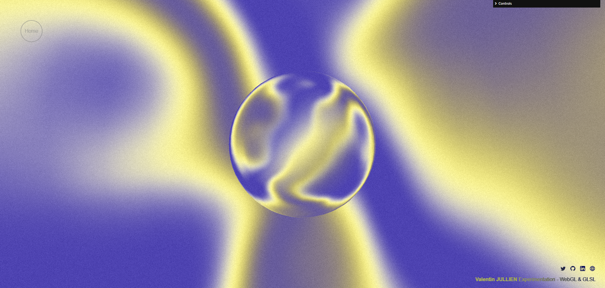

## Shader Blob with Three.js

<!-- Shader blob with custom fresnel effect and noise shader pass. [Three.js](https://threejs.org/). Les musiques sont récupérés grâce à l'API de [Deezer].(https://developers.deezer.com/login?redirect=/api) J'ai ensuite été libre du choix du design et des objets 3D que je voulais rajouter. -->

## Links

[Live](https://shader-blob.vercel.app/)

[GitHub](https://github.com/Valentin667/shader-blob)

## Setup

Download [Node.js].(https://nodejs.org/en/download) Run this followed commands:

```bash
# Install dependencies (only the first time)
npm install

# Run the local server at localhost:8080
npm start

# Build for production in the dist/ directory
npm run build
```

Open [http://localhost:3000](http://localhost:3000) with your browser to see the result.

## Credits

[Yuri Artiukh](https://www.youtube.com/watch?v=sPBb-0al7Y0)


